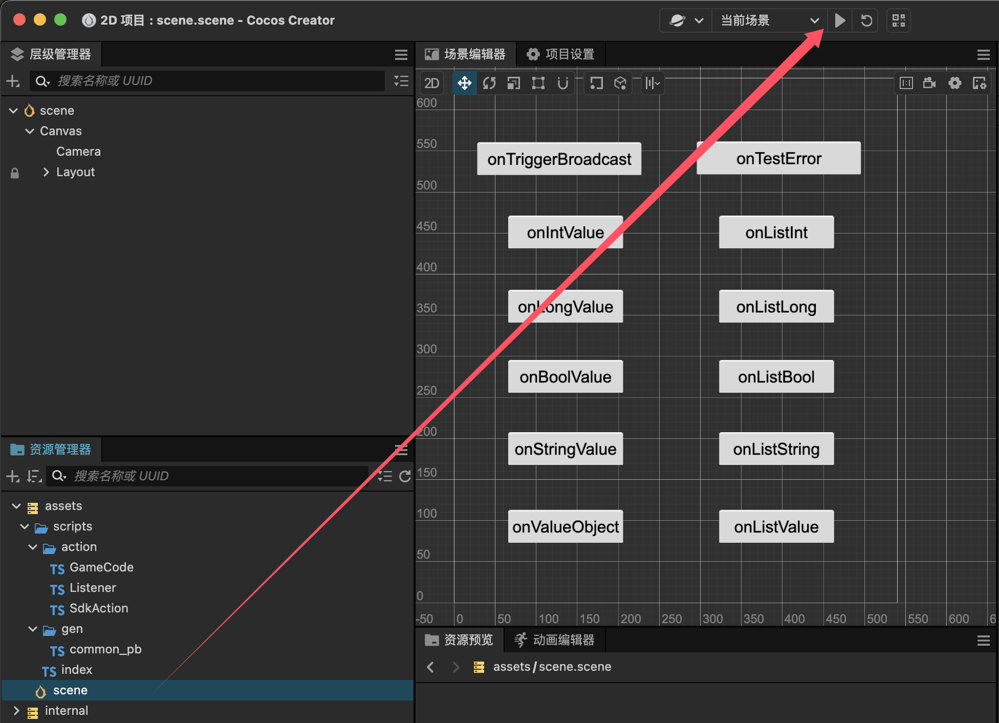
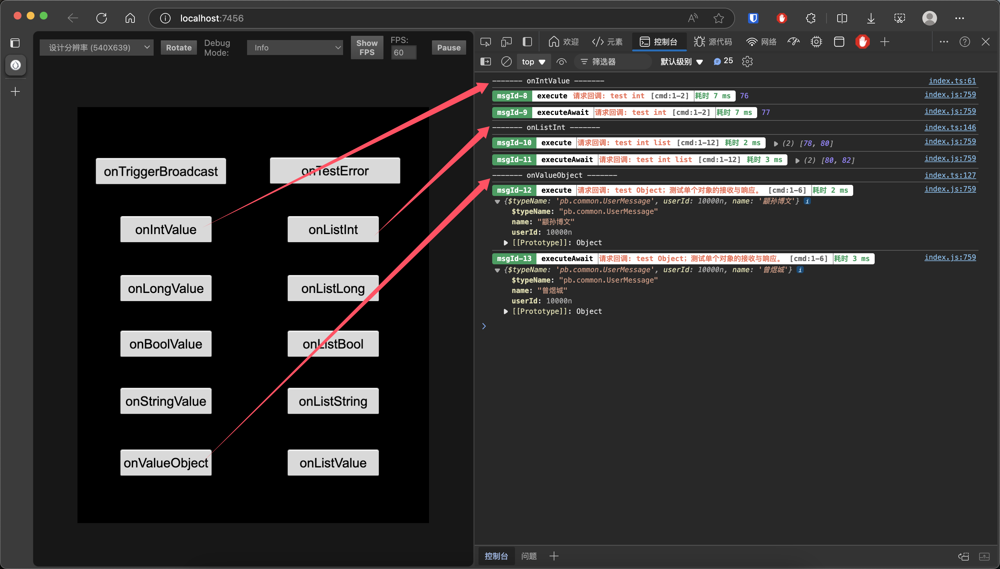

## ioGameSdkTsExampleCocos

该示例使用了 ioGame TypeScript Sdk。ioGame SDK 提供了 Netty、WebScoket、Protobuf、TypeScript、[ioGame](https://www.yuque.com/iohao/game) 游戏服务器交互的简单封装。


该示例是基于 CocosCreator 做的一个简单演示。


**该项目主要演示以下几个方面的内容**

1. ioGame Sdk + 代码生成 = 诸多优势。
2. 使用代码生成后的接口文件（`action、广播`）与服务器交互。
3. 心跳的处理，每次心跳将时间与服务器同步。
4. 交互演示内容包括
    1. [协议碎片](https://www.yuque.com/iohao/game/ieimzn)：“基础类型”的参数与返回值。
    2. List 类型的参数与返回值。
    3. Protobuf 对象类型的参数与返回值。


`./assets/scripts/gen/code` 目录中的 `action、广播、错误码` ...等交互接口文件由  [ioGame 生成](https://www.yuque.com/iohao/game/irth38)。代码生成可为客户端开发者减少巨大的工作量，并可为客户端开发者屏蔽路由等概念。


**SDK 代码生成的几个优势**

1. 帮助客户端开发者减少巨大的工作量，**不需要编写大量的模板代码**。
2. **语义明确，清晰**。生成的交互代码即能明确所需要的参数类型，又能明确服务器是否会有返回值。这些会在生成接口时就提前明确好。
3. 由于我们可以做到明确交互接口，进而可以明确参数类型。这使得**接口方法参数类型安全、明确**，从而有效避免安全隐患，从而**减少联调时的低级错误**。
4. 减少服务器与客户端双方对接时的沟通成本，代码即文档。生成的联调代码中有文档与使用示例，方法上的示例会教你如何使用，即使是新手也能做到**零学习成本**。
5. 帮助客户端开发者屏蔽与服务器交互部分，**将更多的精力放在真正的业务上**。
6. 为双方联调减少心智负担。联调代码使用简单，**与本地方法调用一般丝滑**。
7. 抛弃传统面向协议对接的方式，转而使用**面向接口方法的对接方式**。
8. 当我们的 java 代码编写完成后，我们的文档及交互接口可做到同步更新，不需要额外花时间去维护对接文档及其内容。


## 快速开始

### 启动游戏服务器

see https://github.com/iohao/ioGameExamples/tree/main/SdkExample

> 运行 SdkApplication.java 启动游戏服务器


### 安装相关库

> 首次下载运行，安装相关环境

```sh
npm install
```


### 启动

> CocosCreator Version: 3.8.4

启动客户端后，点击按钮就能与 ioGame 进行通信了。相关的交互的 action 由服务器生成，无需开发者编写。

​	


### 启动页

点击按钮会向服务器发送请求，并接收服务器的响应数据。




## 如何根据 .proto 生成相关 pb

执行命令后，会根据 buf.gen.yaml 生成相关 pb

```shell
npx buf generate
```


.proto 生成的相关配置

```yaml
# Learn more: https://buf.build/docs/configuration/v2/buf-gen-yaml
# npx buf generate
version: v2
inputs:
  - directory: proto
plugins:
  - local: protoc-gen-es
    out: assets/scripts/gen
    opt: target=ts
```


关于 .proto 生成的更多参考 https://github.com/bufbuild/protobuf-es/blob/main/MANUAL.md#how-to-generate-code


## 最后

记住，你不需要编写任何交互文件（`action、广播、错误码`），这些是由 ioGame 服务器生成的，你只需要关注真正的业务逻辑。


